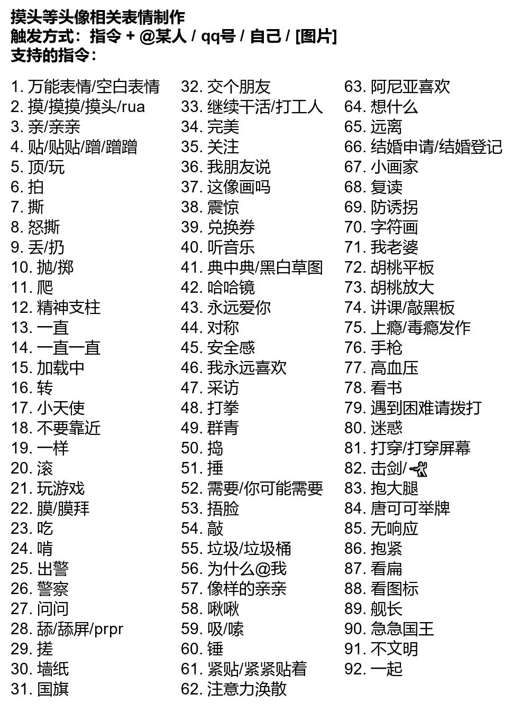

# 命令列表

!!! warning

    观看此章前,我们 **强烈建议** 您先阅读 [观前提示](./notice.md)  
    如果您在未仔细阅读此帮助文档的情况下出现任何问题或损失,小黑猫bot运营组将不会做任何解答,也不负任何责任。

## 基本命令

### 签到模块  

!!! tip inline end

    该模块指令前均 **不需要** 加 `/`

- `签到` 每日签到,每日首签与连续签到都有积分加成~
- `积分` 查看自己所拥有的积分
- `抽奖 <n>` 消耗n积分,随机获取0-3倍积分
- `转账 <n> <@xxx>` 将n积分转账到某人
- `挖矿` 消耗10积分进行挖矿
- `打劫 <@xxx>` 打劫xxx的积分,有几率获得对方的部分积分,也可能打劫不到或被反打劫
- `钓鱼` 消耗10积分进行钓鱼
- `出售` 将钓到的**鱼**进行卖出,获得积分
- `售出` 将挖到的**矿**进行卖出,获得积分
- `猜数字 <n>` 消耗n积分开始猜数字游戏,猜中则积分翻倍。n的范围:1-100
- `我猜 <n>` **仅在猜数字游戏进行时可用** 在指定次数内进行猜数字游戏,n为你所猜的数字,范围:1-100
- `猜拳<石头|剪刀|布> <n>` 消耗n积分进行猜拳游戏,胜利则积分翻倍
- `我的<背包|鱼篓>` 查看挖到的矿或钓到的鱼
- `排行榜` 查看全部用户的积分排行榜,并显示自己的名次
- `领取积分补助` 积分低于10分时每日可领取一次补助

### 图片生成模块

!!! tip inline end

    该模块指令前均 **需要** 加 `/`

图片生成模块分为 `头像表情包生成` 和 `普通表情包生成` 两个子模块以及一些额外指令。

#### 头像表情包

#### 表情包制作

#### 额外指令

- `/5000兆 <上部内容> <下部内容>` 生成5000兆表情包  
- `<emoji>+<emoji>` 生成emoji表情包 **指令中的`+`不可省略** 例：`😊+😍`
  

### 发言排行模块

- `/群话痨排行榜` 看看有史以来(机器人存在以来)群友们发了多少消息!
- `/<今日|昨日|本周|上周|本月|年度|历史>群话痨排行榜` 顾名思义。

### 群友互动模块

#### 群友召唤术
- `/设置召唤 昵称 QQ号` 例: `/设置召唤 猫猫 2572204078`
- `/删除召唤 昵称`
- `/召唤+昵称` **该命令中的加号无需输入**
- `/召唤列表`

//TODO